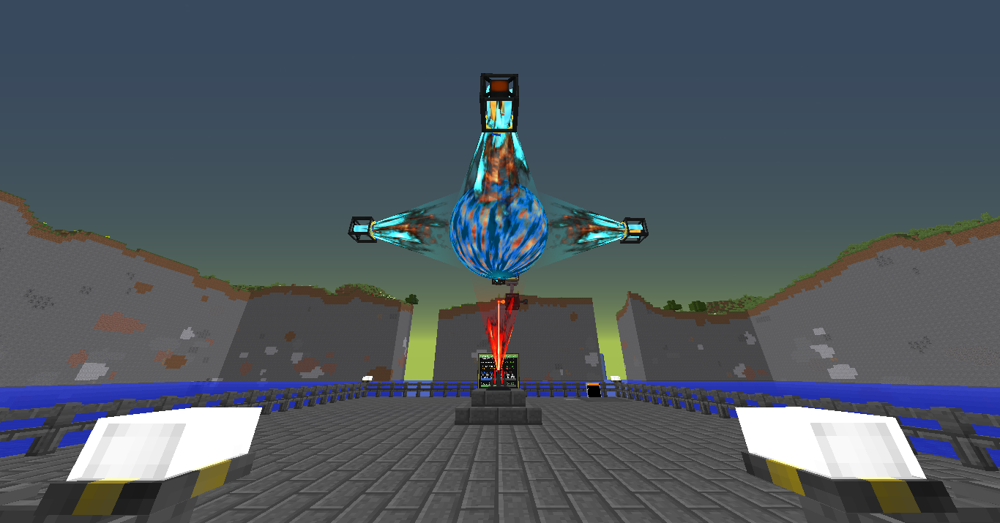

# Draconic Evolution Reactor Controller
* Monitor and failsafe automation for your draconic evolution reactor
* This program is a rewrite of acidjazz's code to make it work in 1.12.2
* link to the original: https://github.com/acidjazz/drmon 



### what is this
This is a computercraft (opencomputers might work but they are not tested) LUA script that monitors everything about a draconic reactor, with a couple features to help keep it from exploding

### tutorial
Not done yet

### features
* Uses a 3x3 advanced computer touchscreen monitor to interact with your reactor
* Automated regulation of the input gate for the targeted field strength of 50%
  * adjustable
* Immediate shutdown and charge upon your field strength going below 20%
  * adjustable
* Immediate shutdown when your temperature goes above 8000C°
  * adjustable
* Safe cooling down system
* Easily tweak your output flux gate via touchscreen buttons
  * +/-100k, 10k, and 1k increments
  


### Requirements
* one fully setup draconic reactor (and fuel, obviously)
* 1 advanced computer
* 9 advanced monitors
* 3 wired modems, wireless will not work
* a bunch of network cables

### Installation
* Your reactor output flux gate must be setup so that one side of it and one of your stabilizers touches a side of the advanced computer
* By default, flux gate should touch the top side, stabilizer on the left of the computer
  * If you want to use different sides you need to modify `startup` after you have installed this and specify the sides
* Connect a modem to your input flux gate (the one connected to your reactor energy injector)
* Connect a modem to your advanced computer (at the botom side)
* Setup your monitors to be a 3x3 and connect a modem to anywhere but the front
* Run network cable to all 3 modems
* Install this code via running the install script using these commands :

```
> pastebin get rhNbNbFE install
> install
```
* Modify `startup` if you wish to configure/alter any variables mentioned in the feature list, you'll find them at the top of the file
* You should see stats in your term, and on your monitor

### Upgrading to the latest version
* Hold ctrl+t until you get a `>`

```
> install
> startup
```

### Warnings
* There can have bugs so please report them in the issue tab above
* Also try to put your reactor in a RF Tools dimension or realy far away and make backups (mod like aroma backups) for prevent damage if an explosion occured
